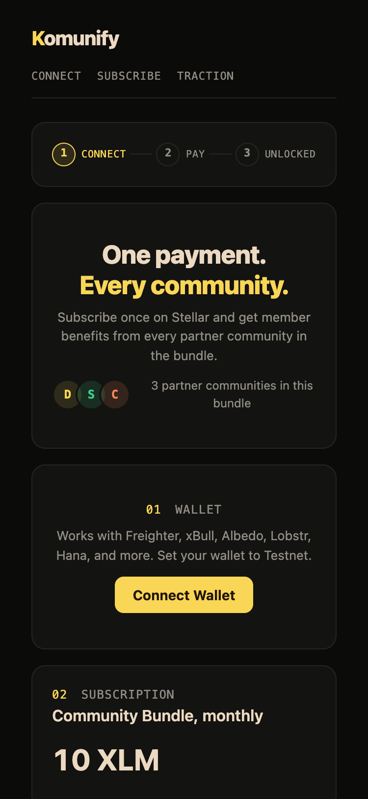
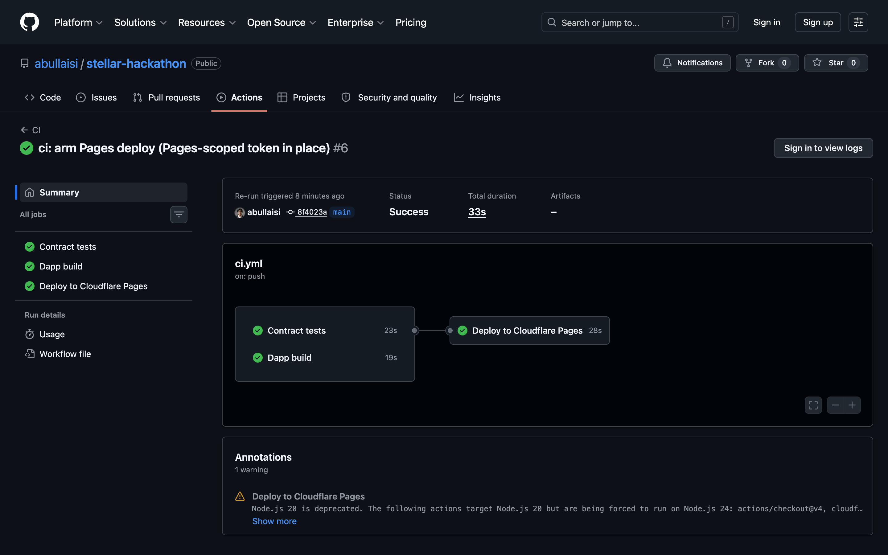

# Komunify

One subscription. Every community.

Members pay once to unlock benefits across multiple communities. Revenue automatically splits between platform, project owner, and community manager—all verified on-chain.

## Try it

- **Live:** https://stellar-hackathon-web.vercel.app (needs Freighter wallet on testnet)
- **Prototype:** https://komunify-prototype.pages.dev

## Contracts (testnet)

| | ID |
|---|---|
| **Komunify** | [`CDRO7PJPVB6U4WYUSA3K3MJ7RVHLQXTNCJMUJM4KKFENRRICZAYLB7CT`](https://stellar.expert/explorer/testnet/contract/CDRO7PJPVB6U4WYUSA3K3MJ7RVHLQXTNCJMUJM4KKFENRRICZAYLB7CT) |
| **Mock USDC** | [`CCT5P37F32YQNK2ER5AAEWPHV5TBMRZOGDKSDZMIBBK2K7JFAJQW4P3S`](https://stellar.expert/explorer/testnet/contract/CCT5P37F32YQNK2ER5AAEWPHV5TBMRZOGDKSDZMIBBK2K7JFAJQW4P3S) |

## Smart Contract

**Komunify** (Soroban, Rust):
- `subscribe(member, amount)` — record payment, auto-split to owner/manager/platform
- `get_subscribers()` — fetch all subscriptions
- `get_count()` / `get_volume()` — stats
- `get_config()` — payout addresses & split %

**USDC** (SEP-41 token mock):
- `transfer()`, `balance_of()`, `faucet()` (500 USDC, 24h cooldown)

## Project Structure

```
stellar-hackathon/
  contracts/                   Soroban contracts (Rust)
    contracts/komunify/        Subscription + split logic
    contracts/usdc/            Mock token
  packages/
    web/                       Next.js frontend + Freighter
    api/                       Hono backend + Postgres
    contract-client/           Generated TS bindings
    shared/                    Zod schemas, types, config
  docs/                        PLAN, API_SPEC, CONTRACT_SPEC
  prototype/                   Design prototype
```

## Build

```bash
# Setup
git clone https://github.com/yoms07/stellar-hackathon.git
cd stellar-hackathon
bun install

# Dev
bun dev                        # All packages
bun --filter web dev           # Frontend only
bun --filter api dev           # Backend only

# Build
bun build                      # All packages
bun typecheck                  # Type-check

# Contract
cd contracts
cargo test -p komunify         # Unit tests
stellar contract build         # Compile to Wasm
```

## Deployment

- **Contracts:** `make deploy-all` from repo root
  - Deploys `usdc`, then `komunify` (wires USDC as token)
  - Set contract IDs in `.env` files
- **Frontend:** Vercel (auto-deployed from main)
- **Backend:** Dokploy via Dockerfile; Postgres on Neon

## Screenshots

| | |
|---|---|
| Desktop app |  |
| Wallet connect |  |
| Balance |  |
| Tx success |  |
| Mobile |  |
| CI/CD |  |

## Team

- **Imam** — product & design
- **Jason** — engineering
- **Faris** — engineering
- **Nada** — business & partnerships

---

**Track:** Payment Consumer Applications  
**Event:** APAC Stellar Hackathon

