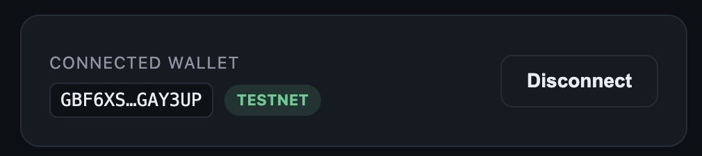
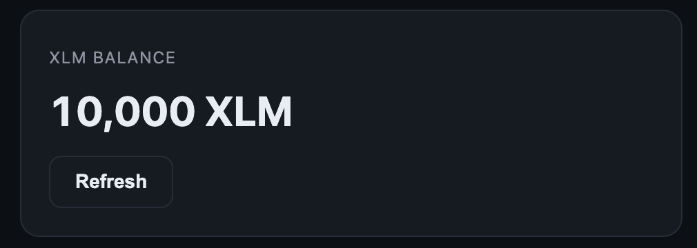
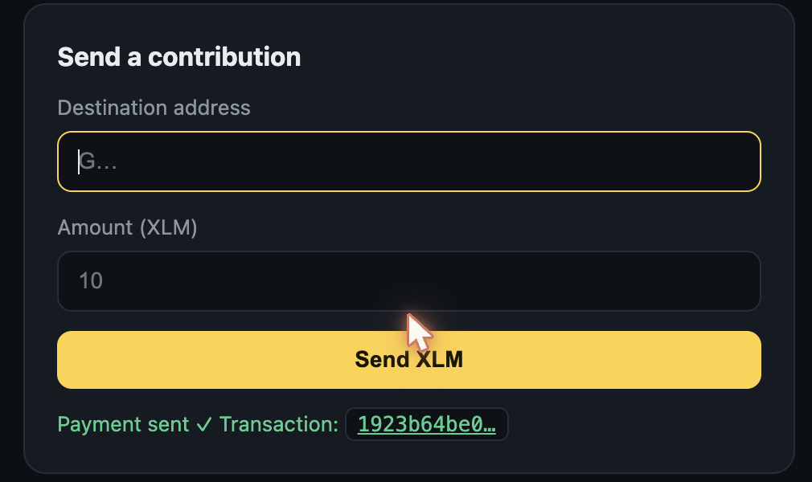
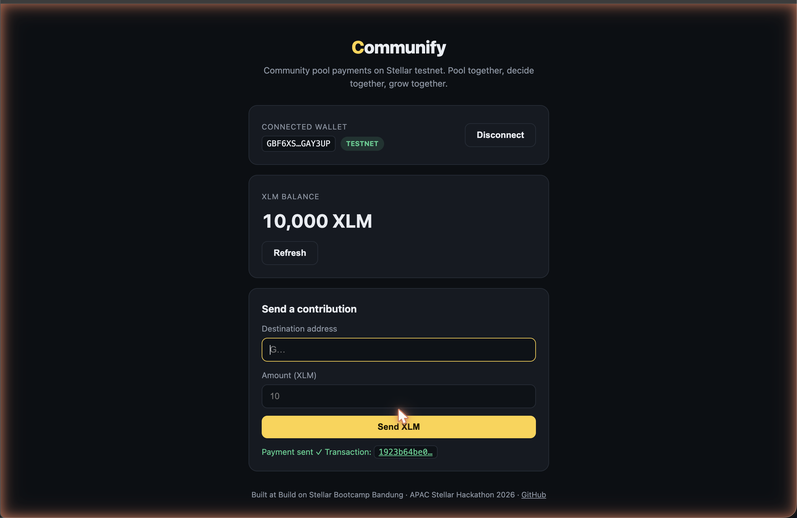

# Communify

**Community-owned real-world assets on Stellar.** A digital koperasi where members pool funds together, decide together what to fund, and share the yield together.

> Status: ideation. Started at Build on Stellar Bootcamp Bandung (July 4-5, 2026), building toward the APAC Stellar Hackathon.

**Track:** Local Finance & Real-World Access

## Problem

Indonesia runs on community finance. Arisan circles, koperasi, patungan: millions of people already pool money with people they trust. But these systems live in notebooks and chat groups. Records get lost, treasurers become single points of failure, funds sit idle earning nothing, and nobody outside the circle can verify anything. Formal investment products exist, but the minimum tickets, paperwork, and English-first UX exclude the people who need them most.

## Why Stellar

- **Asset issuance and a DEX are built into the protocol.** A community pool token doesn't need custom infrastructure.
- **Transactions cost near zero and settle in seconds**, so small contributions (the arisan scale) stay economical.
- **Anchors bridge rupiah to the network**, so members can think in IDR, not crypto.
- **A growing RWA ecosystem on Stellar** (tokenized funds, lending markets) gives pooled funds somewhere productive to go, through composition instead of reinvention.

## Target Users

Existing Indonesian community groups: arisan circles, koperasi members, neighborhood and campus communities. People who already pool money socially but have no transparent ledger, no yield, and no portable proof of their collective savings.

## Proposed Solution

A community pool on Soroban:

1. A community creates a pool and invites members.
2. Members contribute (IDR mental model, stablecoin rails).
3. Every contribution is recorded on-chain: transparent, verifiable, no single treasurer risk.
4. Pooled funds are placed into yield-bearing assets in the Stellar ecosystem.
5. Members vote on what the pool funds next, and yield is shared per contribution.

## Core Features (MVP)

- Create and join a community pool
- On-chain contribution ledger with live pool total
- Member voting on fund allocation
- Yield/share view per member
- Simple wallet onboarding for non-crypto users

## What's in this repo now (Level 1 — White Belt)

The first working slice: a Stellar testnet dApp where a member connects their wallet and sends a contribution.

- Connect and disconnect a Freighter wallet (with network check)
- Fetch and display the connected wallet's XLM balance
- Fund an unactivated account via Friendbot with one click
- Send an XLM payment on testnet with clear feedback: pending, success with transaction hash (linked to Stellar Expert), or failure state

**Tech stack:** React + Vite · `@stellar/freighter-api` (wallet) · `@stellar/stellar-sdk` (Horizon testnet)

## Setup (run locally)

1. Install [Node.js 18+](https://nodejs.org) and the [Freighter](https://www.freighter.app/) browser extension
2. In Freighter, switch the network to **Testnet**
3. Clone and run:

```bash
git clone https://github.com/abullaisi/stellar-communify.git
cd stellar-communify
npm install
npm run dev
```

4. Open http://localhost:5173, connect Freighter, fund with Friendbot if needed, and send a testnet payment

## Screenshots

| State | Screenshot |
|---|---|
| Wallet connected |  |
| Balance displayed |  |
| Successful testnet transaction |  |
| Transaction result shown to user |  |

## Team

- **Imam** — product and design
- **Jason** — engineering
- **Fariz** — engineering
- **Nada** — business and partnerships

## Roadmap

- **MVP:** pool contract on testnet + contribution and voting flow
- **User acquisition:** pilot with real Bandung communities via Dev Web3 Bandung
- **Mainnet vision:** IDR anchor integration and curated RWA yield sources
